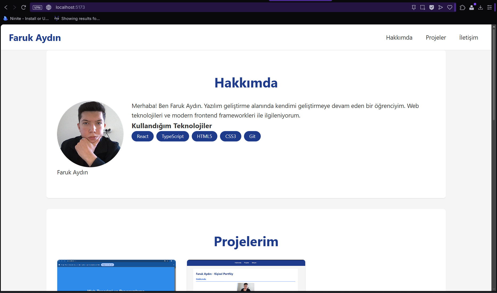
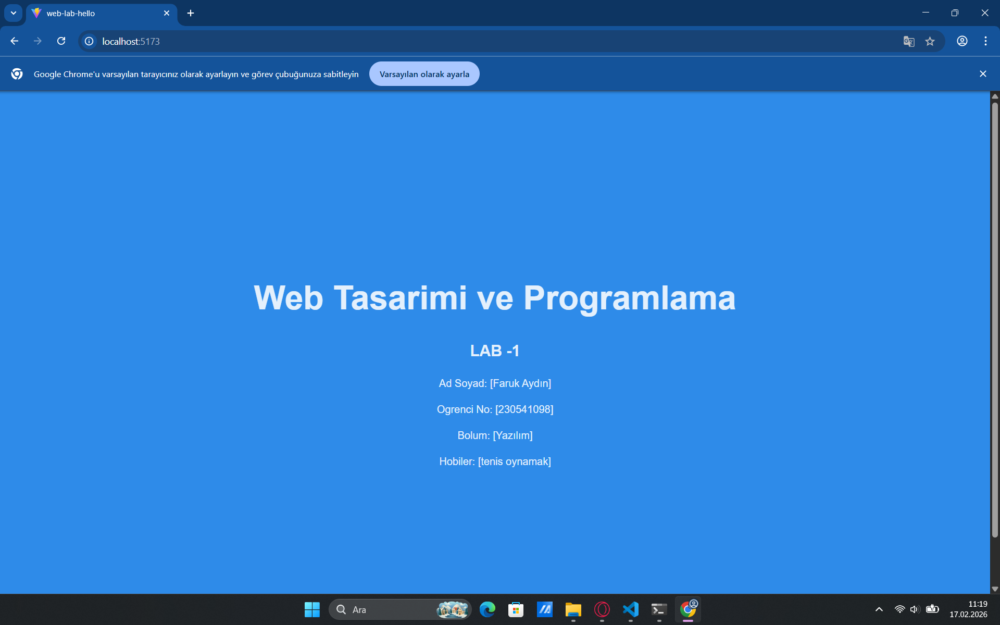
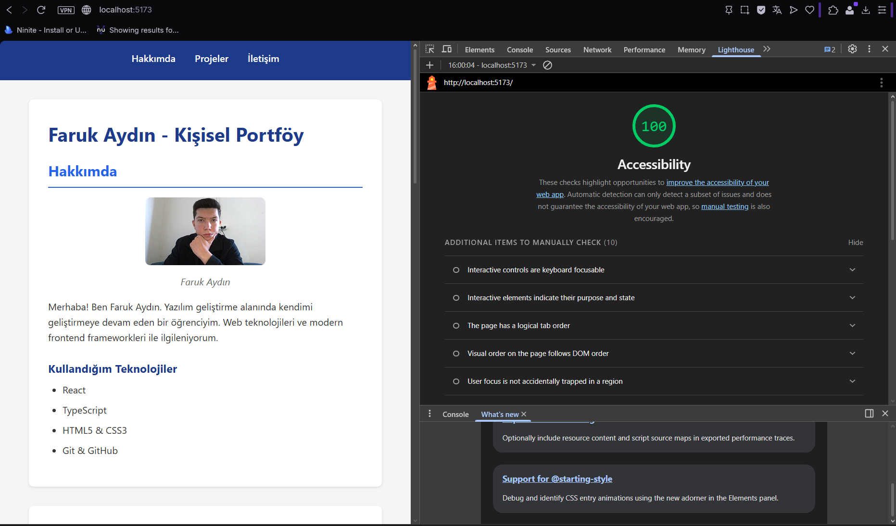
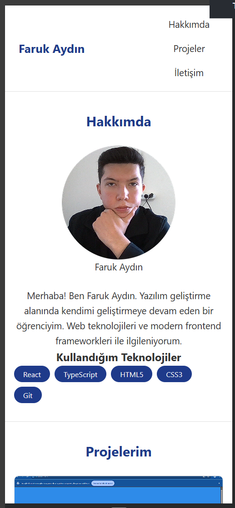

# Web LAB-3 — Kişisel Tanıtım & Portföy Sayfası

**Branch:** `feature/responsive-layout`

## Geliştirici

- **Ad Soyad:** Faruk Aydın
- **Öğrenci No:** 230541098
- **Ders:** Web Tasarımı ve Programlama

## Hakkında

Vite + React + TypeScript ile oluşturulmuş kişisel portföy sayfası.
`feature/responsive-layout` branch'inde mobile-first yaklaşımıyla tam responsive tasarım uygulanmıştır.

**Kullanılan teknolojiler:** React 18 · TypeScript · Vite · Vanilla CSS

## Kurulum

```bash
npm install
npm run dev
```

Tarayıcıda http://localhost:5173 adresini aç.

## Ekran Görüntüleri

### Masaüstü


### Tablet — LAB-1 & LAB-2



### Mobil
